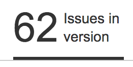
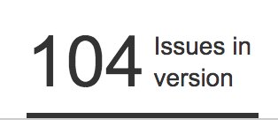
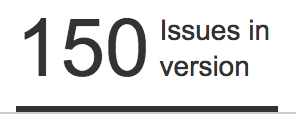

### tales from the front lines
#### modernizing a legacy system

---


Mark Ryan
github.com/markwryan/modernizing-legacy-systems

---

## moving away from a monolith

+++

## why?

Note:
In a perfect world, we shouldn't touch the repo and leave it as is. Lay out why not doing that might be the right choice under certain circumstances. What caused the monolith to be a blocker from where we wanted to go

+++

## issues

Note:
Issues abound -- both from a technical and non-technical perspective.

+++

## workarounds

Note:
Overcome the issues at hand, both for the technical problems, as well as business and people problems that are involved in the process.

+++

## process

Note:
Go through some tools and workflows that were helpful

+++

## lessons learned

Note:
Things we could have done differently

---

# @fa[exclamation-triangle]

+++

## not selling anything

Note:
Not trying to convince anyone this is the only way. If a monolith works for your company, great!

+++

## continually growing process

Note:
Set the stage and set some expectations. Goal of the talk is not to sell one solution in the best, but to educate around some issues and solutions to the issues.

+++

## difficult topics

Note:
Not easy, there is a lot to take into account. We are just starting down this process, and not saying this is the only way or the best way, but has worked for us and has gotten us closer to where we want to be.

---

## monoliths

A single project/solution/repository which contains multiple products as well as their shared dependencies.

---

### motivations

+++

structured, automated releases

Note:
Had issues with manual releases taking a long time. Prone to errors. Every release was different and difficult

+++

separate releases

Note:
Desire to release some apps more often. Lots of changes ended up waiting for releases, leading to larger, more complicated releases.

+++

limit immediate scope of library changes

Note:
Any library change immediately impacts all apps. Hard to plan for and manage. Mitigate risk of making changes

+++

better tracking of changes





Note:
Difficult time tracking what changes are made, what they affect. Even with issue tracking. Changes shouldn't be a surprise.

+++

moving into the cloud

Note:
Setting up a new environment and process, wanted to take lessons learned to make it better.

---

### a starting point

* central repository
* multiple websites, desktop apps, tasks and libraries
* no internal dependency management
* git
* automated builds
* minimal test coverage

Note:
Talk about setup, which is pretty typical. Highlight important factors that make the move possible. Relate to apps of any language.

---

### picking a target

* a tangible project (desktop app, web app)
* being worked on by a single team
* lesson learned: the more self-contained the better

Note:
How to decide on a subject to first try and split out. Note that having a single team working on the project makes things easier, also talk about how picking a more self-contained, or one with few internal dependencies might be easier

---

### moving to a new repo

* created a new repository
* copied the project to the root directory
* deleted everything else
* pushed to new remote

+++

a clean break

Note:
no expectation to pull in changes from the monolith after the change. Importance of a single team.

---

### dev life improvements

* better overall performance in our IDE
* inspections (resharper)

---

### splitting out libraries

needed libraries to be available outside the monolith

+++

published libraries from within the monolith

+++

* quickly became unruly
* messy, difficult to version
* unclear what version was being packaged

---

### packaging

+++

Flexibility

Note:
Versioning each component separately, no longer forced to release everything all at once

+++

Clarity

Note:
Clearly defined relationships between packages. Allows for each package to be first class citizens, with its own set of documentation, CI, tests, and releases.

+++

Reinforce Contracts

Note:
More obvious the contracts between pieces and how important they are to be clearly visible and managed. The differences between method visibility, information sharing, APIs should be more clear between the internal components

+++

Limiting Scope

Note:
In a monolith, a single change can immediately impact all of the applications. Versioning and packaging each component allows changes to be rolled out in a controlled fashion instead of immediately consumed.

+++

Testing

Note:
Smaller, more concise packages are less intimidating to start adding in tests. The increased time and complexity to make a change, build a package and locally deploy and test it will also push developers to write more automated tests that can test and validate changes without having to go through the entire build and deployment lifecycle.

---

## versioning

useful semantic versioning

Note:
Goals around versioning

+++

knowledge gaps

Note:
Gaps around what constituted an increase where. Monolith releases made it even more confusing.

+++

non-developers hated it

Note:
Immediate dislike of not knowing a version till close to release.

+++

"semantic versioning lite"

`MajorChange.PlannedRelease.HotFix`

---

### in-flight changes

+++

packages continue to change while work is being done

+++

updating with changes from the monolith

+++

### git subtree

* similar to git submodules
* repo within a repo
* no added metadata

+++

`git subtree --split`

* takes in a path inside the repo
* creates a branch in the repo only containing that folder as the root

+++

```
cd monolith
git pull origin master
git subtree split --prefix src/Libs/Utilities -b split-utilities
git push origin split-utilities
cd ../Utilities
git pull monolith split-utilities
git push origin master
```

+++

* easily pull over changes as needed
* one-way
* two-way possible

---

### git knowledge gaps

Note:
Talk about how difficult it was for people to take over and deal with moving in packages

+++

internal tool to run script above

https://gist.github.com/markwryan/f341c7d1a2178e1dc03a43e36b32e57c

---

### developing with packages

+++

Working with packages is a completely foreign concept

+++

IDEs can make it tough to edit and consume packages at the same time

+++

Not a lot of help available for C#

+++

Trouble versioning lead to having to pin dependency versions

---

### workflows for testing package changes

Note:
Went through multiple workflows, none of which worked great. Major drawback that was made clear after moving outside of the monolith. talk about why this is so difficult -- because its not a great practice. Knowledge gap around establishing an API and programming against that instead of individual contributions. 

---

### locally including the package source
* most straightforward
* add the project into the solution/workspace

---

### locally including DLL references

* build in visual studio
* update references to point to build DLLs

---

### setting up a local NuGet server

* build
* create package locally
* host a local NuGet feed 

---

### publishing to a outside service

* push git branch
* automated build
* deploy to teamcity or myget

---

### building

* automated builds for every branch
* build of the integration branch
* build of release branch

+++

automated builds on check-in for every branch

+++

control what branches got packaged

+++

automated deploy to our dev environment

---

### deploying

* hybrid setup
* aws
* internal
* directconnect

---

### deploying libraries

existing MyGet account

* manual process
* no setup for access from build server
* privacy issues

+++

TeamCity

* built-in
* immediately accessible to builds
* internally hosted

---

### deploying apps

Octopus Deploy

+++

* create a release version
* releases pushed as NuGet packages
* promoted deployments
* smart configuration replacements
* tenanted deployments
* same, repeatable process internally and in aws 

---

### opportunities for improvement

+++

too much of a good thing

Note:
Talk about how tempting it was to use the packages more than just in the single app. We started using them for more projects because they were readily available. Problem was that the documentation and knowledge around the process to update and manage the packages didn't yet exist. Prioritize getting libraries updated in the monolith.

+++

internal tooling team

+++

push for culture of training

---

### takeaways

* releases
* project management
* insulated project from monolith
* packaging

---

### questions

please fill out the survey on AttendeeHub!

